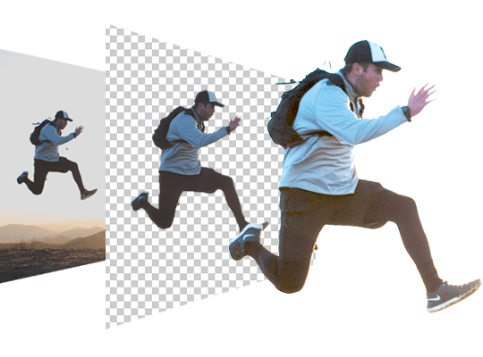
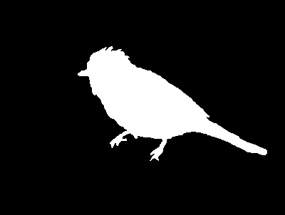
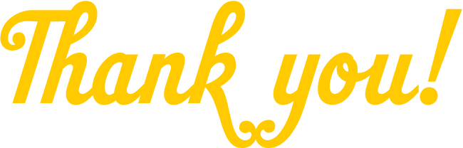

----------------------------------------------------------------------------------------------------------------

<h5> <strong> An applied Artificial Intelligence UseCase by Becode to remove the background in seconds using Deep Learning technologies! </strong> </h5>

---

This project outcome belongs to **[Simon Snyders](https://github.com/simonsny)**, **[Louan Mastrogiovanni](https://github.com/Louan-M)** and **[Gülce Padem](https://github.com/gpadem)**, and **[Arlene Postrado](https://github.com/arlene14ko)** who are currently Junior Data Scientists/AI Operators at BeCode's Theano 2.27 promotion.

- Repository: `image_background_removal`
- Type of challenge: `Learning`
- Level: `Junior Data Scientist`
- Duration: `2 weeks`
- Deadline : `10/06/21 4:00 PM`
- Team challenge: `Group Project`
- Deployment Strategy: `Github Page, Google Colab and Flask`
- Promotion : `AI Theano 2.27`
- Coding Bootcamp: [Becode Artificial Intelligence (AI) Bootcamp](https://becode.org/learn/ai-bootcamp/)

---
## **Table of Contents**
- [Mission Objectives](#mission-objectives)
- [About The Repository](#about-the-repository)
- [How To Use](#how-to-use)
- [Repository](#repository)
- [Main Libraries Used For This Project](#main-libraries-used-for-this-project)
- [Future Plans](#future-plans)
- [Collaboration](#collaboration)
- [Authors Info](#authors-info)
- [Acknowledgements](#acknowledgements)

---

## **Mission Objectives**

- Be able to work with computer vision libraries, and techniques to remove the background on images
- Be able to explore the pre-trained models for background removal on image and videos
- Be able to create and deploy a quality background removal API
- Be able to use Neural Networks and Machine Learning models
- Be able to deploy the models for end customers

---

## **About The Repository**

This use case is given by one of our partner companies to use Deep Learning technologies to remove the background of an image. There are already a lot of pretrained models available. Our partner expects us to get better results either by transfer learning or training our own model.

The goal is to train our own model or use transfer learning to create a model that can give a quality result and also a result that is fast and reliable. We were given the <a href="http://saliencydetection.net/duts/">DUTS Image dataset</a> to train and test on and also 15 High Quality images that the client chose.

 The state-of-the-art models out there are quite powerful at the moment. Because we only had two weeks for this project, we did not manage to push it further than the best results out there. However, we found different approaches that will be fruitful when we have the time and resources to implement. 

This project is currently deployed locally, if you want to try to run this on your own and you don't have a GPU on your computer, you can use  as it needs a lot of computing power.

 

## **How To Use**

### **Installation** 

- If you have a GPU on your computer use the requirements.txt file to install the necessary libraries.
- If you are using Google Colab, the code will work as it is, since we import all the necessary libraries in our code.

### **Repository**

**README.md**

- This file has all the necessary information regarding the project.You are reading it now.
- It is highly recommended to read all the information in the README file.

**.gitignore**

- This specifies which files to ignore when pushing to the repository.

**requirements.txt**

- This files contains all the necessary libraries, used in this project.

**bg_removal_workflow.ipynb**

- This file contains all the code necessary to get an alpha matte image from the original image.
- It shows the workflow followed.
- All the pretrained model steps are shown.

**FlaskApp.ipynb**

- This file contains all the code necessary to locally deploy the process of background removal.
- When you run this code, it is possible to upload an image on a flask app, then see both the original and background removed version of the image.
- For the first uploaded image, it can take some time. From the second on, the process is faster.

**data folder**

- This directory contains the data needed for this project (train and test images).

**utils folder**

- This directory contains python files with useful functions and Classes.
- It also contains all the code necessary to asses the quality of our results.
- We compare the following to eachother:
  * Alpha matte we acquired from the pretrained MODNET model to our ground truth mask we recived in the dataset.
  * Alpha matte we acquired from U2Net to our ground truth mask we recived in the dataset.
  * Alpha matte we acquired from DIM model to our ground truth mask we recived in the dataset.

**FlaskApp folder**

- This directory contains files for the local deployment of the project.

---

### **Main Libraries Used For This Project**

**OpenCV** https://opencv.org/

- OpenCV (Open Source Computer Vision Library) is an open source computer vision and machine learning software library.
- In this project, OpenCV is used to read the image and calculate the erosion and dilation for the trimap.

**PyTorch** https://pytorch.org/

- An open source machine learning framework that accelerates the path from research prototyping to production deployment.
- In this project, PyTorch is used to run a pretrained model.

**Flask** https://flask.palletsprojects.com/en/1.1.x/

- Flask is a micro web framework written in Python. It is classified as a microframework because it does not require particular tools or libraries.
- In this project, flask is used to create the web dashboard application.

---

### **Future Plans**

- We would like to train our own model.
- We would like to increase the quality of our trimap so that we can improve our alpha masking.
- We would like to combine the strengths of different models and understand better how to finetune for a diverse dataset.
---

### **Collaboration**

- This project is open to collaborations as well as forking or cloning for further development. If you wish to clone/fork this repository, you can do so by clicking on the repository, then click the Clone/Fork button and follow the instructions.
---

### **Authors Info**

- Linkedin - **[Simon Snyders](https://www.linkedin.com/in/simon-snyders-9452aa146/)**, **[Louan Mastrogiovanni](https://www.linkedin.com/in/louan-mastrogiovanni-9a0a46143/)** and **[Gülce Padem](https://www.linkedin.com/in/gulce-padem/)**, and **[Arlene Postrado](https://www.linkedin.com/in/arlene-postrado/)**
- Github   - **[Simon Snyders](https://github.com/simonsny)**, **[Louan Mastrogiovanni](https://github.com/Louan-M)** and **[Gülce Padem](https://github.com/gpadem)**, and **[Arlene Postrado](https://github.com/arlene14ko)**

---
### **Acknowledgements**

- We would like to thank our coaches [Chrysanthi Katrini](https://github.com/chrysanthi989) and [Alber Dominguez](https://github.com/nedraki) for giving us the opportunity to work on an interesting use case as this. We also would like to thank our colleagues from BeCode Theano 2.27 promotion for making every project a group effort.

### Thank you for reading. Have fun with the code! 🤗

[**↥ Back To The Top**](#table-of-contents)

---
